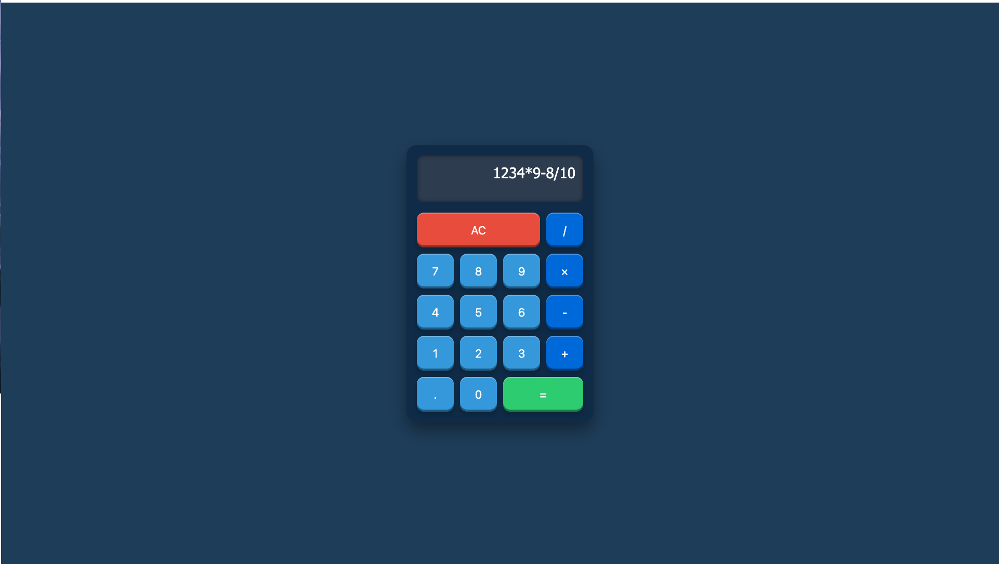

# Calculator Web Application

Course: 
Python Intermediate

Instructor: 
Professor Luis Ed Amaya

Student: 
Dario Li Causi,

Date:
14th April 2025

⸻

Overview

This project presents a web-based calculator application developed as part of the Python Intermediate course. The application integrates a Python Flask backend with an HTML and CSS frontend, enabling users to perform basic arithmetic operations through a user-friendly interface.

⸻

Features
	•	Arithmetic Operations: Supports addition, subtraction, multiplication, and division.
	•	Web Interface: Interactive frontend allowing users to input numbers and select operations.
	•	Real-time Calculation: Processes user input and displays results dynamically without page reloads.

 

⸻

Technologies Used
	•	Backend: Python 3.x with Flask framework
	•	Frontend: HTML5 and CSS3

